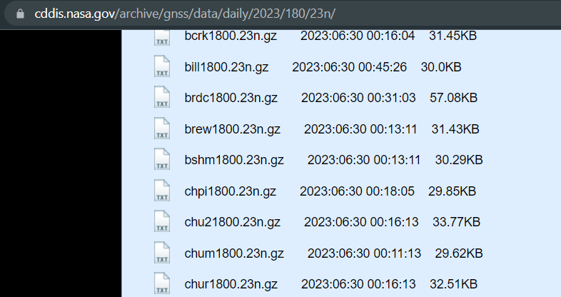
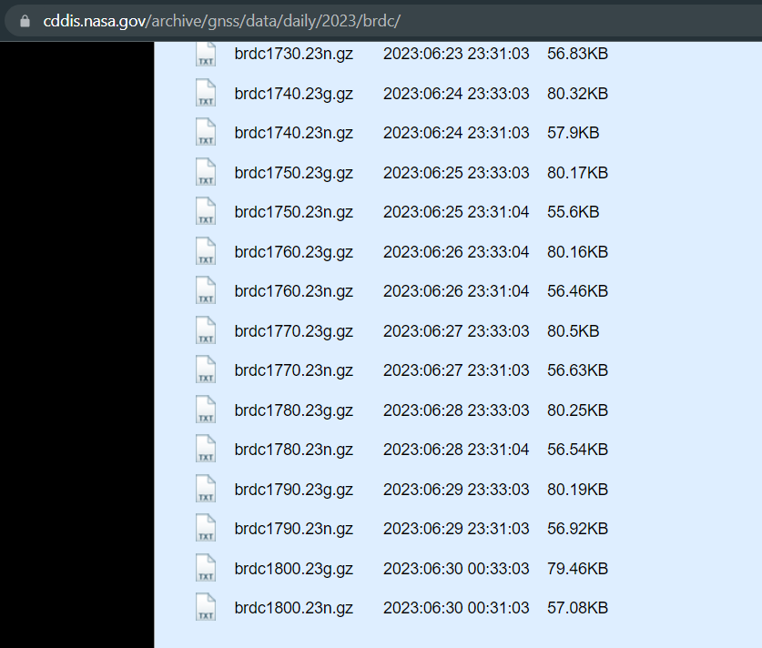

# Application to generate samples for GPS simulation using HackRF PortaPack

Application downloads navigation data in RINEX format from NASA ftp server and generates data samples for GPS simulation using HackRF PortaPack

Usage:

```bash
python gps_sim.py <email>
```

where email - registration email on https://cddis.nasa.gov

Output example:
```bash
Downloading navigation file for 010723 from gdc.cddis.eosdis.nasa.gov ...
Navigation file saved as brdc1820.23n
Generating data samples for GPS signal simulation ...
Data samples saved as loc_010723.C8
```

## What is the BRDC (and Institut für Angewandte Geodaesie) navigation file?

The file https://cddis.gsfc.nasa.gov/archive/gnss/data/daily/yyyy/ddd/yyn/brdcddd0.yyn.Z 

is the daily broadcast ephemeris file. This file is a merge of the individual site navigation files into one, non-redundant file that can be utilized by users instead of the many individual navigation files.

yyyy is the 4-digit year

ddd is the three-digit day of year and yy is the two-digit year




These files are also available in yearly subdirectories of https://cddis.nasa.gov/archive/gnss/data/daily/yyyy/brdc/.

Example: https://cddis.nasa.gov/archive/gnss/data/daily/2023/brdc/brdc1800.23n.gz



## BRDC archive access

https://cddis.nasa.gov/Data_and_Derived_Products/CDDIS_Archive_Access.html


## Other gps/gnss data servers

https://www.unavco.org/data/gps-gnss/file-server/file-server.html

https://www.lantmateriet.se/en/geodata/gps-geodesi-och-swepos/swepos/swepos-services/post-processing/rinex-data---daily-files/

https://incors.in.gov/data.aspx


## Python RINEX parsers

https://pypi.org/project/RinexParser/

https://pypi.org/project/georinex/

## gps-sdr-sim

gps-sdr-sim.exe source code https://github.com/osqzss/gps-sdr-sim


